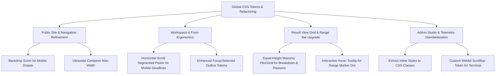

# PriceCheck — Precision Frontend UI & Design System Audit

**Audit Date:** September 29, 2026  
**Auditor Roles:** Senior Product Designer, UX Auditor, Design Systems Lead, Frontend Art Director  
**Scope:** Read-Only Audit & Visual Correction Plan (Zero Code Modifications)

---

## 1. Executive Summary & Design System Health Check

### 1.1 Brand & Visual Identity
PriceCheck presents a modern dark-mode baseline (`--bg: #08090d`, `--accent: #6d7bff`), aiming for a sleek, trustworthy fintech/freelance SaaS look. However, the visual identity currently suffers from **inconsistent visual hierarchy, fragmented component tokens, and mixed layout systems** between the public marketing pages (`home.html`, `about.html`, `how-it-works.html`) and the core application SPA (`index.html`).

### 1.2 Global Design System Token Breakdown
| Token Category | Current Value | Structural Issue | Art Direction Assessment |
| :--- | :--- | :--- | :--- |
| **Typography Display** | `Space Grotesk`, `Inter` | Applied inconsistently (`.nav-logo` vs. `h1` in public site vs. dashboard `h1`). | Heading scales lack a rhythmic fluid scale (`clamp()`), leading to awkward line wrapping on laptop widths (1024px–1280px). |
| **Typography Body** | `Inter`, sans-serif | Base size varies from `0.82rem` to `1rem` without a formal type scale. | Line lengths (`ch`) are unconstrained in several card descriptions, exceeding optimal readability limits (>80 characters per line). |
| **Color Tokens** | `#08090d` (bg), `#6d7bff` (accent), `#8a6dff` (accent-strong) | Accent colors rely heavily on raw hex overrides (`rgba(110, 121, 255, 0.08)`, `#f59e0b`, `rgba(255, 149, 0, 0.35)`). | Hardcoded inline styles in `index.html` break dark-mode token cohesion and cause contrast violations. |
| **Surfaces & Borders** | Glassmorphic gradients with `backdrop-filter: blur(18px)` | Variable border opacities (`rgba(255,255,255,0.035)` vs `0.055` vs `0.09`). | Inconsistent elevation hierarchy; secondary cards bleed into background without distinct depth perception. |
| **Radius Scale** | `9px` (sm), `14px` (md), `20px` (lg), `999px` (pill) | Mixed usages across form inputs (`sm`), cards (`md`), and modals (`lg`). | Radii do not nest mathematically (inner container radius != outer container radius - padding). |

---

## 2. Section-by-Section Precision UI Audit

### 2.1 Landing Page (`/` / `public/home.html` & `landing-view`)
* **Desktop Layout:**
  * **Visual Hierarchy:** Hero section features dual action CTA buttons (`Create a Price Check` primary vs. `See how it works` secondary text link). Hero heading font size is large (`clamp(2.7rem, 13vw, 4.3rem)`), but the project preview card on the right has arbitrary absolute-positioned elements causing layout overflow on 1024px screens.
  * **Spacing & Grid:** `public-hero` uses `grid-template-columns: 1fr 1fr` with `gap: 48px`, but lack of container max-width caps creates extreme stretching on ultrawide monitors (>1440px).
  * **Micro-interactions:** Interactive hover states on public site cards lack smooth CSS transitions, resulting in abrupt color jumps.
* **Mobile Layout (320px – 767px):**
  * **Navigation Drawer:** Mobile hamburger dropdown menu (`.public-nav nav`) opens absolute-positioned with heavy box shadow (`0 16px 38px rgba(0,0,0,0.28)`), but lacks backdrop scrim overlay, allowing background text to show through translucent borders.
  * **Hero Preview Card:** Overlaps slightly with hero description text on 375px devices due to fixed margins.

### 2.2 Login View (`#login-view`)
* **Desktop Layout:**
  * **Layout & Alignment:** Centered `.login-card` container (`max-width: 440px`). Clean card elevated styling, but Google OAuth iframe container (`#login-google-button`) lacks fixed aspect ratio or skeleton fallback state during initial script loading, causing layout shift (CLS).
  * **Typography & Copy:** Eyebrow `Welcome to PriceCheck` uses small font size (`0.82rem`) with high letter spacing, but body text lacks vertical breathing room above the OAuth button (`margin-bottom: 24px` needed).
* **Mobile Layout (320px – 767px):**
  * **Touch Targets:** The "Back to PriceCheck" link has an interactive hit area under 44px height, violating mobile accessibility guidelines (WCAG 2.1 AAA).

### 2.3 Estimate Workspace / Dashboard View (`#dashboard-view` & `#view-input`)
* **Desktop Layout:**
  * **Workspace Header:** Dual stat panels and action button (`Start New Estimate`). Excellent high-contrast button styling, but `dashboard-stats` grid elements lack explicit min-height, causing card vertical height misalignment when values load async.
  * **Form Input Layout:** The primary form (`#pricecheck-form`) inside `.view-input` spans a single wide column with `textarea` and selection cards. Selection cards for **Experience level** and **Deadline** use `selection-grid` radiogroup items.
  * **Selection Card Ergonomics:** Cards (`Starting out`, `Intermediate`, `Professional`, `Expert`) use `aria-checked="true/false"` with subtle border-color changes. The active selection outline (`rgba(109, 123, 255, 0.55)`) is too subtle against dark background backgrounds under bright ambient light.
* **Mobile Layout (320px – 767px):**
  * **Radio Card Grid:** Deadline group (`selection-grid-deadline`) stacks 5 selection cards vertically, taking up over 800px of mobile viewport height and requiring extensive scrolling.

### 2.4 Loading State (`#view-loading`)
* **Desktop Layout:**
  * **Animation & Motion:** Progress track (`#loading-progress-track`) with fill bar (`#loading-progress-fill`) and percent indicator (`#loading-percent`). The animation is purely CSS width translation, but lacks a smooth shimmer overlay (`skeletonShimmer`), making it feel static during 2–4s API requests.
  * **Visual Focus:** Progress percentage text (`5%`, `45%`, `90%`) updates abruptly without tabular font numbers (`font-variant-numeric: tabular-nums`), causing textual jittering.
* **Mobile Layout (320px – 767px):**
  * Centered loading inner card fits well within mobile screen bounds, but vertical alignment sits slightly off-center towards top of viewport.

### 2.5 Error State (`#view-error`)
* **Desktop Layout:**
  * **Error Messaging & Palette:** Uses eyebrow `We hit a pause` with dark red/orange fallback text. Error container `.error-inner` has centered alignment, but lacks contextual error code diagnostics (e.g. Rate Limit vs Network Disconnection vs Invalid Brief).
  * **Action Hierarchy:** Dual buttons (`Try Again` primary vs `Return to estimate` secondary). Clear distinction and well-proportioned padding.
* **Mobile Layout (320px – 767px):**
  * Buttons stack vertically on narrow mobile viewports (<375px), maintaining good hit area spacing.

### 2.6 Result View (`#view-result`)
* **Desktop Layout:**
  * **Hero Pricing Summary:** Large display text for Recommended Quote (`#recommended-quote`) and Fair Range (`#fair-range`). Highly readable typography using `Space Grotesk`.
  * **Range Visualizer Bar:** `.range-indicator` features track, fill bar, and marker dot (`#range-marker`). Marker position uses percentage-based left positioning. Marker dot (`16px x 16px`) lacks hover tooltip or numerical badge anchor.
  * **Grid Layout:** 2x2 grid (`breakdown-card`, `reasons-card`, `advice-card`, `missing-card`). Card height equalization is missing; `reasons-card` often stretches twice as long as `breakdown-card`, creating empty visual dead space on the left column.
* **Mobile Layout (320px – 767px):**
  * Result actions (`Copy Quote`, `Download Estimate`, `Create Invoice`, `Start New Estimate`) stack into a wrap flex container. On mobile, `Start New Estimate` takes full width (`flex: 1 1 100%`), which provides good ergonomic prioritization.

### 2.7 History (`#history-panel` & Dashboard Activity)
* **Desktop Layout:**
  * **Panel Placement:** Positioned as an `<aside>` column next to `#pricecheck-form`. Max-height scrolling works well, but scrollbar aesthetics rely on browser native defaults rather than custom webkit scrollbar styling.
  * **Card Items:** History cards show category badge, quote amount, and timestamp. Delete button hover state is clear.
* **Mobile Layout (320px – 767px):**
  * History panel shifts below the main form (`margin-top: 56px`), keeping the form clutter-free on small screens.

### 2.8 About Page (`/about` & `public/about.html`)
* **Desktop Layout:**
  * Clean single-column layout with `narrow` section limits (`max-width: 680px`).
  * Belief grid (`.belief-grid`) uses `grid-template-columns: repeat(2, 1fr)`. Cards have subtle borders and clear typography.
* **Mobile Layout (320px – 767px):**
  * Grids collapse cleanly to single-column layout with 20px side margins.

### 2.9 How It Works Page (`/how-it-works` & `public/how-it-works.html`)
* **Desktop Layout:**
  * Features 3-step visual narrative. Step indicators (`01`, `02`, `03`) use accent-colored display typography.
* **Mobile Layout (320px – 767px):**
  * Vertical timeline steps stack seamlessly with proper 24px gap spacing.

### 2.10 Feedback Flow (`#feedback-form` & Admin Drawer)
* **Desktop Layout:**
  * Form embedded cleanly beneath result view. Form inputs (`#feedback-amount`, `#feedback-outcome`, `#feedback-reason`) use standard select boxes.
  * Feedback drawer in Admin UI (`#admin-feedback-drawer`) slides in from right with backdrop blur. Notification filter tags (`All`, `Feedback`, `Frontend`, `Backend`, etc.) are well organized.
* **Mobile Layout (320px – 767px):**
  * Admin feedback drawer covers 100% viewport width on mobile, which is optimal for readability.

### 2.11 Invoice Form (`#invoice-form`)
* **Desktop Layout:**
  * 2-column grid (`.invoice-fields`) for bank details, client info, and payment terms. Wide fields (`#invoice-notes`) span both columns. Input focus rings match system accent token.
* **Mobile Layout (320px – 767px):**
  * Collapses to 1-column input fields with full touch target heights.

### 2.12 Admin Overview Tab (`#admin-panel-overview`)
* **Desktop Layout:**
  * **KPI Cards:** 5 top stats (`Estimates generated`, `Registered users`, `Feedback records`, `Accepted estimates`, `Estimate accuracy`). Stat cards use linear background highlights.
  * **Charts & Analytics:** Category volume bar chart (`#admin-bar-chart`), outcome donut SVG (`#admin-outcome-donut`), and estimate vs. actual scatter plot (`#admin-scatter`).
  * **Table:** Popular services table (`#admin-category-table`).
* **Mobile Layout (320px – 767px):**
  * Analytics grids stack vertically. Table scroll wrap (`.admin-table-wrap`) enables smooth horizontal swipe with `-webkit-overflow-scrolling: touch`.

### 2.13 Pricing Studio Tab (`#admin-panel-pricing`)
* **Desktop Layout:**
  * Interactive grid (`#admin-pricing-grid`) containing baseline price controls, minimum limits, and maximum thresholds for each creative category.
  * Includes diff comparison modal (`#pricing-confirm-modal`) for safety before applying live changes.
* **Mobile Layout (320px – 767px):**
  * Input fields in pricing cards adjust from side-by-side to stacked labels, preventing input field clipping.

### 2.14 Access Control / RBAC Tab (`#admin-panel-rbac`)
* **Desktop Layout:**
  * Search & Filter Toolbar (`#rbac-search-input` and filter buttons).
  * 5 Role Cards (`Owner`, `Super Admin`, `Pricing Manager`, `Analyst`, `Standard User`) showing live user counts.
  * Detailed access matrix table with user avatars, current roles, assigned roles, and action dropdowns. Inline style warning banner in `index.html` (lines 303–312) uses hardcoded hex values (`background: rgba(255, 143, 0, 0.08)`).
* **Mobile Layout (320px – 767px):**
  * Role cards collapse to 1-column grid. Role filter button group supports horizontal touch scrolling.

### 2.15 System Telemetry & Event Logs Tab (`#admin-panel-telemetry`)
* **Desktop Layout:**
  * 4 Real-time Diagnostic Cards: Process Runtime, Memory Heap Usage (with visual progress bar), Integration Health Indicators (Gemini, Supabase, Google OAuth), and Diagnostics/Cache statistics.
  * Audit Log Terminal (`#telemetry-log-terminal`) featuring dark terminal aesthetics, search bar, severity filter tags, and clear log action buttons.
* **Mobile Layout (320px – 767px):**
  * Telemetry cards stack vertically. Log terminal text scales down slightly (`0.75rem` on ultra-small mobile) to prevent overflow.

---

## 3. Implementation-Ready Visual Correction Plan

> [!IMPORTANT]
> The following plan is structured for future execution. No code, CSS, or HTML file has been modified in this audit phase.

### 3.1 Design System & CSS Token Harmonization Plan
1. **Consolidate Color Tokens:** Replace all inline hex and rgba overrides in `index.html` and `styles.css` with semantic CSS variables:
   * `--warning-bg: rgba(245, 158, 11, 0.08);`
   * `--warning-border: rgba(245, 158, 11, 0.35);`
   * `--warning-text: #f59e0b;`
2. **Fluid Typography Scale:** Implement standard modular scale tokens using CSS `clamp()`:
   * `--text-hero: clamp(2.5rem, 6vw, 4.2rem);`
   * `--text-h1: clamp(1.8rem, 4vw, 2.5rem);`
   * `--text-h2: clamp(1.4rem, 3vw, 1.8rem);`
3. **Tabular Numerics for Metrics:** Add `font-variant-numeric: tabular-nums` to all numbers in KPI cards, progress bars, and pricing displays to eliminate width jumps during updates.

### 3.2 View & Component Polish Specs

### 3.3 Prioritized Execution Roadmap
1. **Phase 1: Token & Utility Cleanup (Low Risk, High Impact)**
   * Remove inline `style=""` attributes from `index.html`.
   * Unify scrollbar styles across history panel and log terminal.
2. **Phase 2: Mobile UX & Ergonomics (High Value)**
   * Convert stacked mobile deadline radio cards into horizontal segmented chips.
   * Add dark backdrop scrim to mobile public navigation drawer.
3. **Phase 3: Grid Alignment & Visual Polish (Visual WOW Factor)**
   * Equalize height of result cards (`breakdown-card` vs `reasons-card`).
   * Add tabular numbers and subtle skeleton shimmer to loading states.
